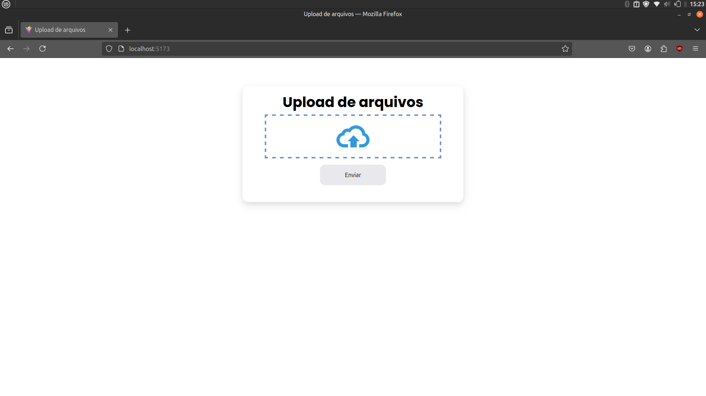

# File Upload Project

Um sistema simples de upload de arquivos.


## Pré-requisitos

Antes de iniciar o projeto, verifique se você tem os seguintes itens instalados em sua máquina:

- Docker
- Docker Compose

## Configuração de variáveis de ambiente:

- Dentro da pasta server, renomeie o arquivo `.env.example` para `.env`.
- Configure as variáveis de ambiente conforme necessário.

## Passos para rodar o projeto:

1. Clone o repositório:

```
git clone https://github.com/jcoffeex/file-upload.git
cd file-upload
```

2. Construir e iniciar o contêiner com Docker Compose:

```
docker-compose up --build
```

3. Iniciar o contêiner em modo normal (caso já tenha feito o build anteriormente):

```
docker-compose up
```

## Vídeo

<a href='https://fqvdbgearwiwcebrpbop.supabase.co/storage/v1/object/public/file/demonstration.mp4'>Link do vídeo<a/>
